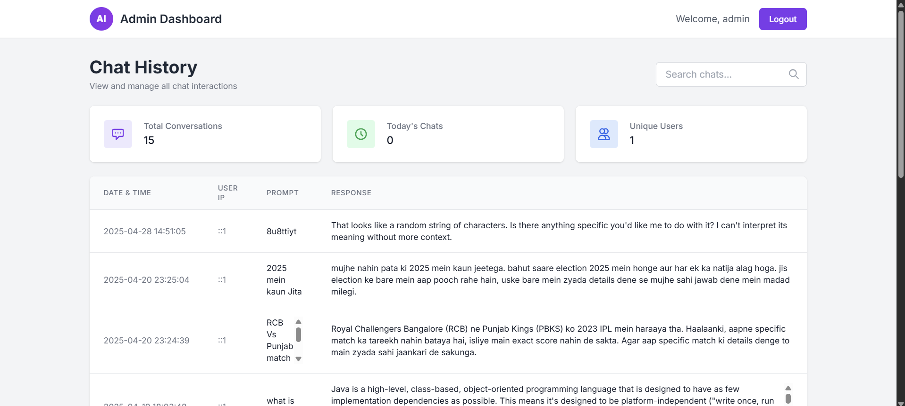

# 🧠 AI Assistant (Powered by Gemini AI)

A **real-time, intelligent chat application** built with **PHP**, **MySQL**, **JavaScript**, and **AJAX**, fully integrated with the **Gemini AI API** to generate smart, dynamic responses. Users can enjoy a human-like conversational experience in real-time!

<p align="center">
  
  
  
  
  
  
</p>

---

## ✨ Features

- 🔐 **User Registration & Secure Login**  
  - Passwords hashed using PHP’s `password_hash()`  
  - Session-based authentication  

- 💬 **Real-Time Chat**  
  - AJAX-powered messaging for instant updates  
  - Live typing indicator & online/offline status  

- 🤖 **AI-Powered Responses**  
  - Messages sent to Gemini API via PHP server  
  - Gemini AI generates smart replies in milliseconds  
  - Seamless conversational flow—just like chatting with a real person  

- 🚀 **Lightweight & Fast**  
  - Minimal dependencies for snappy performance  
  - Clean, responsive UI ensures smooth experience on desktop and mobile  

- 🔒 **Security Best Practices**  
  - Input validation & sanitization to prevent SQL Injection  
  - CSRF protection on critical endpoints  
  - HTTPS (recommended for production)  

---

## 🧰 Tech Stack

| Layer            | Technology                         |
|------------------|-------------------------------------|
| Frontend         | HTML5, CSS3, JavaScript (AJAX)      |
| Backend          | PHP (Core PHP)                      |
| AI Integration   | Gemini AI API                       |
| Database         | MySQL                                |
| Version Control  | Git                                 |

---

## 🧠 How Gemini AI Integration Works

1. **User Sends a Message**  
   - The chat interface captures the user’s input and triggers an AJAX request.

2. **PHP Server Forwards to Gemini API**  
   - `includes/gemini_api.php` handles API authentication and request formatting.
   - The user’s message is sent over HTTPS to the Gemini endpoint.

3. **Gemini AI Generates a Reply**  
   - Gemini processes the prompt and returns a context-aware, human-like response.

4. **Reply Displayed in Real-Time**  
   - AJAX callback renders Gemini’s reply instantly in the chat window.

✨ This seamless integration creates an **interactive, intelligent chat** that feels remarkably natural.

---

## 📂 Project Structure

<details>
<summary>Click to expand</summary>


### 🔍 Explanation of Key Folders

- **public/**  
  Only files under `public/` should be directly accessible via the browser. Everything else lives outside the web root for security.

- **src/Controllers/**  
  Each controller handles a specific set of routes (e.g., `AuthController` for login/register, `ChatController` for message endpoints). They coordinate between models, services, and templates.

- **src/Models/**  
  Models contain methods for interacting with the MySQL database (e.g., `User::create()`, `Message::getRecentMessages()`).

- **src/Services/**  
  Encapsulate external API calls (Gemini). Keeping Gemini logic here ensures controllers remain clean and focused on request/response flow.

- **src/Utils/**  
  Common helper classes: input validation (`Validator::sanitize()`), standard response formatting for AJAX (`Response::json()`), and any other reusable functions.

- **src/Templates/**  
  If you’re using PHP includes (instead of a full templating engine), store partial templates here (header, footer, form snippets, chat window, error pages).

- **config/**  
  Single source of truth for configuration variables (DB credentials, API keys). Keeping `config.php` outside `public/` prevents accidental exposure.

- **database/**  
  Store your SQL schema, seed data, or migration scripts here. You can extend for versioned migrations as your project grows.

- **logs/** (Optional)  
  Write runtime errors or chat activity (for debugging/troubleshooting). Make sure `logs/` is writable by the web server.

- **tests/** (Optional)  
  Unit tests or integration tests (e.g., with PHPUnit). Helps ensure core functionality (authentication, chat, Gemini integration) remains stable.

- **vendor/** (Optional)  
  If you use Composer for dependencies (e.g., a PSR-4 autoloader, Guzzle HTTP client), they live here. Otherwise, omit.

- **.gitignore**  
  Ignore sensitive files and folders:  


</details>

---

## 📸 Screenshots

> Screenshots will go here once available.

Example placeholders:

- **Login Page**  
  

- **Registration Page**  
  
  
- **Admin Page**  
  

- **Chat Interface**  
  

---

## 🚀 Installation & Setup

Follow these steps to get the Chat App up and running locally:

### 1. Clone the Repository
```bash

git clone https://github.com/bhaktofmahakal/Chat-app-integreted-with-Gemini.git
cd Chat-app-integreted-with-Gemini
