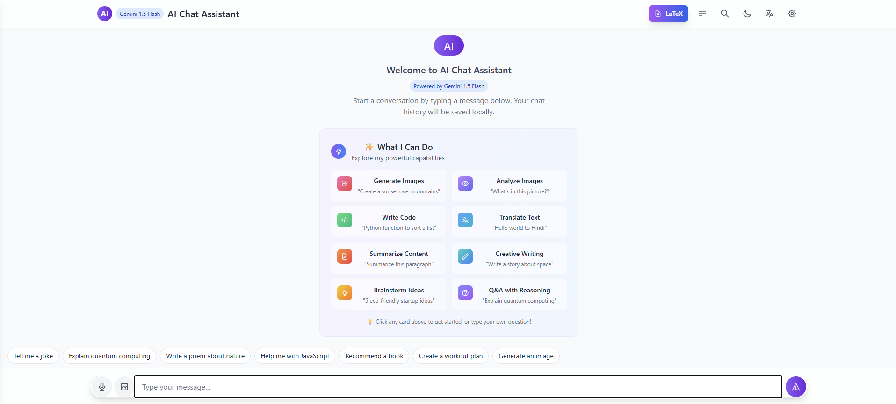
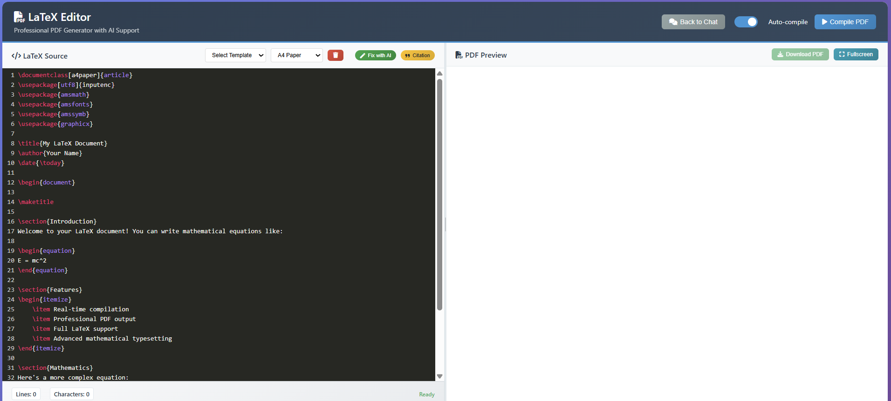
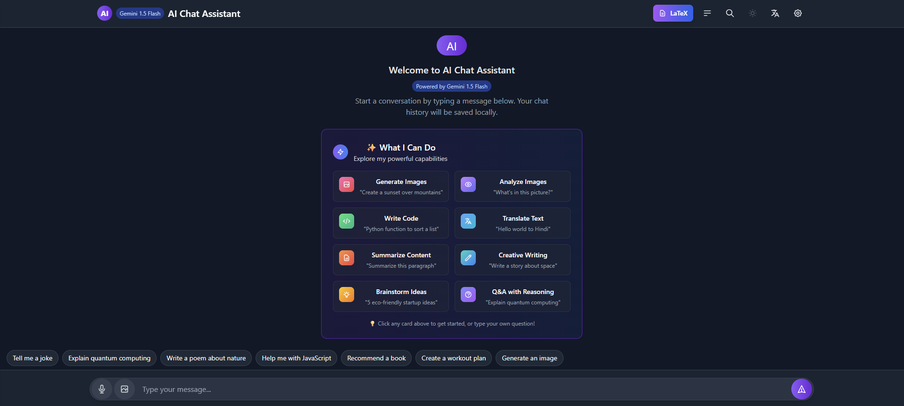

# 🤖 AI Assistant Chat Application

[](https://github.com/bhaktofmahakal/Chat-app-integreted-with-Gemini)
[](https://php.net)
[](https://mysql.com)
[](https://www.latex-project.org/)

<!-- 🚀 High-Impact GitHub Banner -->
<p align="center">
  
</p>

**AI Assistant Chat Application** is a cutting-edge, full-stack conversational AI platform that harnesses the power of Google's Gemini 1.5 Flash model to deliver intelligent, context-aware responses. Built with modern web technologies, it features an integrated LaTeX editor, comprehensive admin dashboard, and advanced chat management capabilities.

---

## ✨ Key Highlights

🧠 **Advanced AI Integration** – Powered by Google Gemini 1.5 Flash for intelligent conversations  
📝 **LaTeX Editor** – Full-featured document creation with real-time compilation  
🔒 **Admin Dashboard** – Comprehensive management and analytics panel  
🌓 **Dark/Light Mode** – Adaptive themes for optimal user experience  
📱 **Responsive Design** – Seamless experience across all devices  
🔄 **Real-time Streaming** – Live AI response streaming for better UX  

---

## 🚀 Core Features

### 💬 AI Chat Interface
- **Intelligent Conversations**: Integration with Google's Gemini 1.5 Flash model
- **Context-Aware Responses**: Dynamic system prompts based on query type
- **Real-time Streaming**: Live streaming of AI responses
- **Image Analysis**: Upload and analyze images within conversations
- **Code Syntax Highlighting**: Multi-language code formatting support
- **Session Management**: Persistent chat sessions with unique identifiers
- **Rate Limiting**: Built-in protection against API abuse (10 req/min)

### 📄 LaTeX Editor
- **Full-Featured Editor**: Advanced LaTeX editing with syntax highlighting
- **Real-time Compilation**: Automatic/manual document compilation
- **PDF Preview**: Instant preview of compiled documents
- **Template Library**: Pre-defined templates (article, report, book, letter, presentation)
- **AI-Assisted Editing**: "Fix with AI" feature for error resolution
- **Multiple Paper Sizes**: Support for A4, Letter, Legal formats
- **Citation Management**: Advanced bibliography and citation tools

### 🛠️ Admin Dashboard
- **Usage Analytics**: Comprehensive statistics and metrics
- **User Management**: Monitor and manage user activity
- **Session Monitoring**: View complete chat sessions and messages
- **API Performance**: Track successful/failed requests
- **Data Export**: Export chat data, analytics, and user information
- **Content Moderation**: Safety controls and content filtering

### 🔐 Security & Performance
- **Input Validation**: Protection against injection attacks
- **Session Security**: Secure cookie management
- **Error Handling**: Comprehensive logging and error management
- **CORS Support**: Secure cross-origin resource sharing
- **Performance Optimization**: Efficient API request handling

---

## 🧰 Tech Stack

### Frontend
- **HTML5, CSS3, JavaScript** – Modern web standards
- **Bootstrap 5** – Responsive UI framework
- **Font Awesome** – Icon library
- **CodeMirror** – Advanced code editor
- **PDF.js** – Client-side PDF rendering

### Backend
- **PHP 8+** – Server-side scripting
- **MySQL** – Relational database
- **Google Gemini API** – AI integration
- **LaTeX/TeXLive** – Document compilation

### Development Tools
- **Git** – Version control
- **Composer** – Dependency management
- **XAMPP/LAMP** – Development environment

---

## 📁 Project Architecture

<details>
<summary>🏗️ Click to expand project structure</summary>

```
AI-Assistant-Chat-Application/
├── 🔧 admin/                          # Admin dashboard & management
│   ├── dashboard.php                  # Main admin overview
│   ├── analytics.php                  # Usage statistics & charts
│   ├── user_management.php            # User monitoring & control
│   ├── session_viewer.php             # Chat session management
│   └── export_data.php                # Data export functionality
├── 🎨 assets/                         # Frontend static assets
│   ├── css/                          # Stylesheets & themes
│   │   ├── main.css                  # Primary application styles
│   │   ├── dark-theme.css            # Dark mode styling
│   │   └── latex-editor.css          # LaTeX editor specific styles
│   ├── js/                           # JavaScript modules
│   │   ├── ai-chat.js                # Chat functionality
│   │   ├── latex-editor.js           # LaTeX editor logic
│   │   ├── admin-dashboard.js        # Admin panel scripts
│   │   └── utils.js                  # Utility functions
│   └── images/                       # Application assets
├── 🔐 auth/                          # Authentication system
│   ├── login.php                     # User login
│   ├── register.php                  # User registration
│   ├── logout.php                    # Session termination
│   └── password_reset.php            # Password recovery
├── ⚙️ config/                        # Configuration files
│   ├── database.php                  # Database connection
│   ├── gemini_config.php             # AI API configuration
│   └── app_settings.php              # Application settings
├── 🔗 includes/                      # Reusable components
│   ├── header.php                    # Common header
│   ├── footer.php                    # Common footer
│   ├── navigation.php                # Navigation menu
│   ├── chat_functions.php            # Chat utility functions
│   ├── latex_functions.php           # LaTeX processing
│   └── admin_functions.php           # Admin utilities
├── 📄 latex/                         # LaTeX editor module
│   ├── editor.php                    # LaTeX editor interface
│   ├── compiler.php                  # Document compilation
│   ├── templates/                    # Document templates
│   └── compiled/                     # Generated PDFs
├── 🗄️ api/                           # API endpoints
│   ├── chat_endpoint.php             # Chat API
│   ├── latex_compile.php             # LaTeX compilation API
│   ├── upload_handler.php            # File upload API
│   └── admin_api.php                 # Admin API endpoints
├── 📊 logs/                          # Application logs
│   ├── chat_logs/                    # Chat session logs
│   ├── error_logs/                   # Error tracking
│   └── api_logs/                     # API usage logs
├── 🏠 pages/                         # Main application pages
│   ├── chat.php                      # Main chat interface
│   ├── latex_editor.php              # LaTeX editor page
│   ├── profile.php                   # User profile
│   └── help.php                      # Help & documentation
├── 📂 uploads/                       # User uploaded files
│   ├── images/                       # Uploaded images
│   └── documents/                    # Document uploads
├── 🗃️ database/                      # Database files
│   ├── schema.sql                    # Database structure
│   ├── migrations/                   # Database migrations
│   └── seeders/                      # Sample data
├── index.php                         # Application entry point
├── .htaccess                         # Apache configuration
├── composer.json                     # PHP dependencies
├── package.json                      # Node.js dependencies
└── README.md                         # Project documentation
```

</details>

---

## 🚀 Quick Start

### Prerequisites
- PHP 8.0 or higher
- MySQL 5.7 or higher
- Apache/Nginx web server
- Google Gemini API key
- LaTeX distribution (TeXLive recommended)

### 1. Clone the Repository
```bash
git clone https://github.com/bhaktofmahakal/Chat-app-integreted-with-Gemini.git
cd Chat-app-integreted-with-Gemini
```

### 2. Install Dependencies
```bash
# Install PHP dependencies
composer install

# Install Node.js dependencies (if applicable)
npm install
```

### 3. Database Setup
```bash
# Import database schema
mysql -u your_username -p your_database < database/schema.sql

# Configure database connection
cp config/database.example.php config/database.php
# Edit database.php with your credentials
```

### 4. Environment Configuration
```bash
# Copy and configure environment settings
cp .env.example .env

# Add your Google Gemini API key
GEMINI_API_KEY=your_api_key_here
```

### 5. Launch Application
```bash
# Start development server
php -S localhost:8000

# Or configure with Apache/Nginx
# Point document root to project directory
```

Visit `http://localhost:8000` to access the application.

---

## 📸 Application Screenshots

### 💬 AI Chat Interface
<div align="center">
  
</div>

---

### 📝 LaTeX Editor
<div align="center">
  
</div>

---

### 📊 Admin Dashboard
<div align="center">
  
</div>

---

### 🌓 Dark Mode Interface
<div align="center">
  
</div>


---

## 🔧 Configuration Options

### Gemini AI Settings
```php
// config/gemini_config.php
define('GEMINI_API_KEY', 'your_api_key');
define('GEMINI_MODEL', 'gemini-1.5-flash');
define('MAX_TOKENS', 8192);
define('TEMPERATURE', 0.7);
```

### Rate Limiting
```php
// config/app_settings.php
define('RATE_LIMIT_REQUESTS', 10);
define('RATE_LIMIT_WINDOW', 60); // seconds
define('MAX_MESSAGE_LENGTH', 4000);
```

### LaTeX Compiler
```php
// config/latex_config.php
define('LATEX_COMPILER', 'pdflatex');
define('LATEX_TIMEOUT', 30); // seconds
define('MAX_COMPILE_SIZE', '10MB');
```

---

## 🛡️ Security Features

- **Input Sanitization**: All user inputs are validated and sanitized
- **SQL Injection Prevention**: Prepared statements for database queries
- **XSS Protection**: Output encoding and content security policies
- **CSRF Protection**: Token-based request validation
- **Rate Limiting**: API abuse prevention mechanisms
- **Session Security**: Secure session management with httpOnly cookies

---

## 📈 Performance Optimizations

- **Response Caching**: Intelligent caching of AI responses
- **Database Indexing**: Optimized database queries with proper indexing
- **Asset Minification**: Compressed CSS and JavaScript files
- **Image Optimization**: Automatic image compression and resizing
- **Lazy Loading**: Progressive loading of chat history
- **CDN Integration**: Static asset delivery optimization

---

## 🤝 Contributing

We welcome contributions! Please follow these steps:

1. **Fork** the repository
2. **Create** a feature branch (`git checkout -b feature/amazing-feature`)
3. **Commit** your changes (`git commit -m 'Add amazing feature'`)
4. **Push** to the branch (`git push origin feature/amazing-feature`)
5. **Open** a Pull Request

### Development Guidelines
- Follow PSR-12 coding standards for PHP
- Use meaningful commit messages
- Add unit tests for new features
- Update documentation as needed

---

## 📝 API Documentation

### Chat Endpoint
```http
POST /api/chat_endpoint.php
Content-Type: application/json

{
    "message": "Your message here",
    "session_id": "unique_session_id",
    "image": "base64_encoded_image" // optional
}
```

### LaTeX Compilation
```http
POST /api/latex_compile.php
Content-Type: application/json

{
    "latex_content": "\\documentclass{article}...",
    "template": "article",
    "paper_size": "a4"
}
```

---

## 🔍 Troubleshooting

### Common Issues

**Q: Gemini API not responding**
- Verify your API key is correct
- Check rate limits haven't been exceeded
- Ensure internet connectivity

**Q: LaTeX compilation fails**
- Verify TeXLive is properly installed
- Check document syntax for errors
- Ensure sufficient disk space

**Q: Database connection errors**
- Verify MySQL service is running
- Check database credentials
- Ensure database exists and is accessible

---

## 📊 System Requirements

### Minimum Requirements
- **PHP**: 8.0+
- **MySQL**: 5.7+
- **RAM**: 16GB
- **Storage**: 200GB free space
- **LaTeX**: TeXLive 2020+

### Recommended Requirements
- **PHP**: 8.2+
- **MySQL**: 8.0+
- **RAM**: 8GB+
- **Storage**: 150GB free space
- **LaTeX**: TeXLive 2023+

---


## 🙏 Acknowledgments

- **Google Gemini Team** for providing the AI API
- **LaTeX Project** for the document preparation system
- **Open Source Community** for various libraries and tools
- **Contributors** who help improve this project

---

## 📞 Support & Contact

- **GitHub Issues**: [Report bugs and feature requests](https://github.com/bhaktofmahakal/Chat-app-integreted-with-Gemini/issues)
- **Discussions**: [Community discussions and Q&A](https://github.com/bhaktofmahakal/Chat-app-integreted-with-Gemini/discussions)
- **Email**: [Contact the maintainer](mailto:utsavmishraa005@gmail.com)

---


<p align="center">
  <strong>"The best way to predict the future is to create it."</strong><br>
  — Peter Drucker
</p>

---

<p align="center">
  
  
  
</p>
